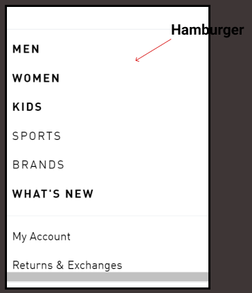

# **dsgn270-a2**
# **Maryam Khan** 
# **Treasure Hunt**

 ### Navigation Breakdown

 ### **Adidas**

Link to website: [Adidas]( https://www.adidas.ca/en?cm_mmc=AdiSEM&gclid=CjwKCAiA0KmPBhBqEiwAJqKK496vONNxE7sg9lrRmV0oPa-5m99YChOLzfbm6OLRogInzmvOzqvWKBoCCn8QAvD_BwE&gclsrc=aw.ds)

  
 

 

 

 

### Hero Section Critique

*	Adidas' hero section is a good example of visual hierarchy. 
*   Their target audience is from age 13 to 30 and over who are passionate about fitness and sports. The majority of their customers are upper middle class.
    The website provides easy access to clothes and shoes for  all kinds of atheletes as well as new updates or Offers.
*   The hero section has call-to-action `shop now` and `feedback`. It is an effective call-to-action.
*   The website is asking user to buy the product and leave feedback. The user can search and login.
*   The colour-contrast :
    * Overall the colour contrast is good, but some sections are too bright.
*   The repetition of elements is good.
    * They are using elements like buttons and forms that users are familiar with.
*   The font style is readable and looks nice too. There is not too much text.
*   The negative space is well balanced.

This image is the example of bright color:

