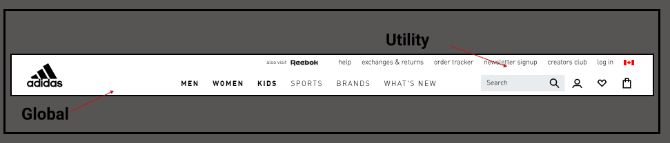

# **dsgn270-a2**
# **Maryam Khan** 
# **Treasure Hunt**

 ### Navigation Breakdown

 ### **Adidas**

Link to website: [Adidas]( https://www.adidas.ca/en?cm_mmc=AdiSEM&gclid=CjwKCAiA0KmPBhBqEiwAJqKK496vONNxE7sg9lrRmV0oPa-5m99YChOLzfbm6OLRogInzmvOzqvWKBoCCn8QAvD_BwE&gclsrc=aw.ds)

  
 

 

 

 

### Hero Section Critique

*	Adidas hero section is good example of visual hierarchy. 
*   Their target audience is from age 13 to 30 and over who are passionate about fitness and sports. Although their majority of customer is upper middle class customers.
     It offer easy access to all the Adidas stores online. The website provides easy access to cloth , shoes for  all kind of sports  for user .  
      * And new updates or Offers.
*   The hero section has call-to-action `shop now` and `feedback` it is an effective call-to-action.
*   The website is asking user to buy the product and leave feedback.The user can search and login.
     * The colour-contrast :
        * I do not like. some are so bland and some are so bright so distracting.
     * The repetition is good.
     * They are using all the things like buttons , forms that user are familiar with.
     * The font style is ok they could use batter overall i think it is readable and looks nice too.There is not not too much text.
     * The negitive space or well balanced.

